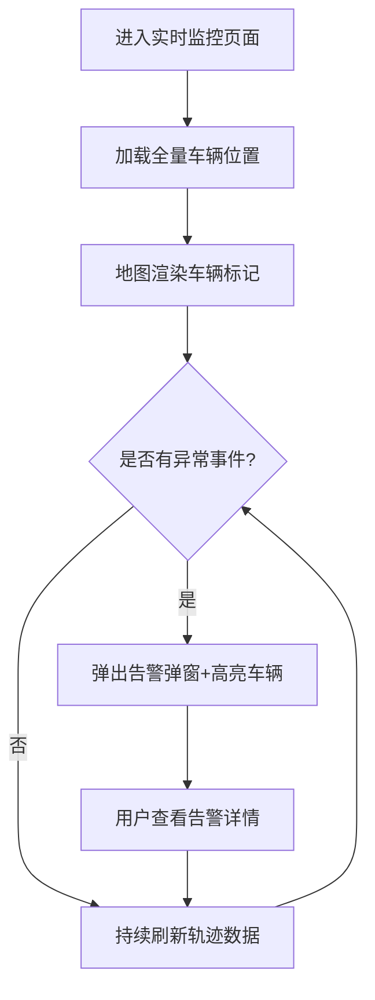
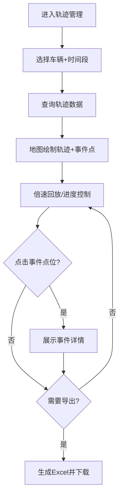

## 1. 产品概述

基于高精定位的可靠性试验运行管理系统是一套面向车辆可靠性试验场景的专业管理平台，通过高精GPS定位技术、IMC采集设备与360°摄像头，实现对试验车辆的实时监控、轨迹追溯、驾驶员状态分析与设备全生命周期管理。

- 核心价值：保障试验过程安全可控，提升数据采集准确性，降低失能事件风险，为可靠性试验提供数据决策支撑
- 目标用户：试验场管理人员、车队调度人员、安全监管人员、数据分析人员

## 2. 核心功能

### 2.1 功能模块总览

1. **实时监控模块**：全量车辆在线地图、动态轨迹刷新、状态预警、实时告警弹窗
2. **轨迹管理模块**：历史轨迹回放、事件点位标注、轨迹数据导出
3. **驾驶员失能统计模块**：单车实时统计、多维度报表、风险分级、报表导出
4. **设备管理模块**：IMC采集设备管理、360摄像头绑定、告警阈值配置

### 2.2 页面详情

| 页面名称 | 模块名称 | 功能描述 |
|---------|---------|---------|
| 实时监控 | 车辆地图 | 展示全量车辆GPS坐标、车速、行驶方向，支持缩放与漫游 |
| 实时监控 | 动态轨迹 | 车辆行驶轨迹持续刷新，离线车辆灰化，超速/失能高亮 |
| 实时监控 | 告警弹窗 | 失能事件弹窗，显示抓拍图片、时间、车速、位置 |
| 实时监控 | 车辆列表 | 左侧车辆状态列表，支持搜索、筛选、快速定位 |
| 轨迹管理 | 轨迹查询 | 选择车辆与时间段查询历史轨迹 |
| 轨迹管理 | 轨迹回放 | 倍速播放历史轨迹，暂停/继续/进度拖动 |
| 轨迹管理 | 事件标注 | 轨迹上标注失能、超速事件点位，点击查看详情 |
| 轨迹管理 | 数据导出 | 导出Excel（时间、经度、纬度、车速、失能标记） |
| 失能统计 | 单车看板 | 当日失能总次数、累计时长、重度失能次数 |
| 失能统计 | 趋势分析 | 日/周/月失能趋势折线图、面积图 |
| 失能统计 | 风险排行 | 车辆风险排行榜柱状图、表格 |
| 失能统计 | 类型分布 | 失能类型饼图、堆叠图 |
| 失能统计 | 风险分级 | 驾驶员低/中/高风险标签、列表筛选 |
| 失能统计 | 报表导出 | 支持车队筛选，导出Excel/PDF |
| 设备管理 | IMC设备 | 设备列表、绑定车辆、在线状态、信号强度监测 |
| 设备管理 | 摄像头 | 一车多摄像头关联、视频点播入口 |
| 设备管理 | 阈值配置 | 重度失能判定时长、超速阈值自定义设置 |

## 3. 核心流程

### 3.1 实时监控流程
用户进入系统后默认展示实时监控页面，地图上显示所有车辆的实时位置与状态。当检测到失能或超速事件时，系统自动弹出告警窗口，同时车辆在地图上高亮显示。用户可点击告警窗口查看详情，或在左侧列表中筛选特定车辆进行聚焦监控。

### 3.2 轨迹回放与导出流程
用户切换到轨迹管理模块，选择目标车辆和时间范围，系统加载对应时间段的轨迹数据并在地图上绘制。用户可控制回放倍速、暂停、拖动进度条。轨迹上自动标注失能与超速事件点位，点击可查看详情。确认数据后可一键导出Excel格式报告。

### 3.3 统计分析与设备管理流程
用户可在失能统计模块查看单车当日数据、多维度趋势报表和风险分级，支持按车队筛选后导出Excel或PDF报告。在设备管理模块，管理员可管理IMC采集设备的绑定与在线状态，配置360°摄像头关联，并自定义告警阈值参数。

## 4. 用户界面设计

### 4.1 设计风格
- **主色调**：科技深蓝 #0A2540（专业/稳重/工业感）
- **辅助色**：警示红 #EF4444（告警/失能）、预警橙 #F59E0B（超速）、成功绿 #10B981（正常在线）、信息蓝 #3B82F6（选中/高亮）
- **背景色**：深空灰 #0F172A（深色仪表盘风格，减少屏幕疲劳，突出数据可视化）
- **卡片色**：深蓝灰 #1E293B 叠加微透明度，营造层级质感
- **按钮风格**：直角硬朗风格，带细微边框和hover上浮效果，强调工业科技感
- **字体**：主字体使用 "Noto Sans SC"（中文思源黑体，清晰专业），数字和代码使用 "JetBrains Mono" 等宽字体，突出数据感
- **布局风格**：左侧垂直导航栏 + 顶部状态栏 + 主内容卡片式栅格布局，经典仪表盘结构
- **图标风格**：线性图标（Ant Design Icons），配合颜色语义（红=告警，绿=正常，灰=离线）

### 4.2 页面设计概要

| 页面名称 | 模块名称 | UI元素设计 |
|---------|---------|-----------|
| 实时监控 | 车辆地图 | 全屏暗色Leaflet地图，车辆标记使用方向箭头，灰化=离线、红闪=失能、橙闪=超速，脉冲动画表示在线 |
| 实时监控 | 告警弹窗 | 右侧滑入式抽屉，红色顶部警示条，抓拍图片大图，时间/车速/位置信息网格布局 |
| 实时监控 | 车辆列表 | 左侧可折叠面板，搜索框+状态筛选标签，每行含车号+状态灯+车速+方向 |
| 轨迹管理 | 查询面板 | 顶部查询栏：车辆选择器+日期范围+查询按钮，栅格紧凑布局 |
| 轨迹管理 | 回放控制 | 底部播放控制条：播放/暂停、倍速下拉（1x/2x/4x/8x）、进度条滑块、时间刻度 |
| 失能统计 | 看板卡片 | 4个圆角大卡片展示核心指标，数字渐变高亮，底部微趋势折线 |
| 失能统计 | 图表区域 | ECharts深色主题图表：趋势折线、排行柱状、类型饼图，交互tooltip |
| 设备管理 | 表格列表 | Ant Design ProTable，支持筛选、排序、分页，操作列含绑定/配置按钮 |
| 设备管理 | 阈值配置 | 表单卡片：滑块+数字输入框联动，预设常用值快捷按钮，保存后即时生效提示 |

### 4.3 响应式设计
- 桌面端优先设计（1920×1080及以上），保证地图和图表最大可视区域
- 支持1366×768最低分辨率，栅格系统自动压缩间距
- 左侧导航栏在中等分辨率下可折叠为图标模式
- 不做移动端适配，本系统为桌面端专业管理平台

### 4.4 动效与交互
- 页面加载：卡片从上到下渐入（staggered animation）
- 车辆标记：在线状态呼吸脉冲动画，失能/超速状态红色/橙色闪烁
- 告警弹窗：从右侧滑入+背景模糊遮罩+警示音视觉暗示
- 图表交互：hover高亮、点击下钻、数据区域渐变填充
- 按钮/卡片：hover时细微上浮+阴影加深，点击时按压反馈
