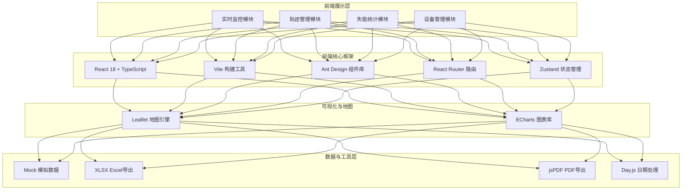

## 1. 架构设计



## 2. 技术选型说明

- **前端框架**: React 18 + TypeScript 5 — 类型安全、组件化开发、生态成熟，适合复杂管理系统
- **构建工具**: Vite 5 — 开发启动快、HMR热更新流畅、生产构建优化
- **UI组件库**: Ant Design 5 — 企业级组件丰富，深色主题支持完善，符合管理系统审美
- **路由管理**: React Router v6 — 声明式路由，支持嵌套布局
- **状态管理**: Zustand — 轻量简单，无需Provider包裹，适合中小规模全局状态
- **地图引擎**: Leaflet 1.9 — 开源轻量、API友好，配合自定义标记实现车辆监控
- **图表库**: ECharts 5 — 图表类型丰富，深色主题、交互效果出色
- **数据导出**: XLSX (SheetJS) + jsPDF — 分别处理Excel和PDF导出需求
- **日期处理**: Day.js — 轻量级moment替代，API一致

## 3. 路由定义

| 路由路径 | 页面组件 | 页面说明 |
|---------|---------|---------|
| `/` | 重定向至 `/monitor` | 根路径默认跳转到实时监控 |
| `/monitor` | MonitorPage | 实时监控模块（主页面，含地图+车辆列表+告警） |
| `/track` | TrackPage | 轨迹管理模块（查询+回放+导出） |
| `/statistics` | StatisticsPage | 驾驶员失能统计模块（看板+图表+导出） |
| `/devices` | DevicesPage | 设备管理模块（IMC+摄像头+阈值配置） |

## 4. 数据模型定义

### 4.1 车辆数据模型 (Vehicle)
```typescript
interface Vehicle {
  id: string;
  plateNumber: string;      // 车牌号
  fleet: string;            // 所属车队
  driverName: string;       // 驾驶员姓名
  driverRiskLevel: 'low' | 'medium' | 'high'; // 风险等级
  status: 'online' | 'offline' | 'disabled' | 'overspeed'; // 当前状态
  gps: {
    longitude: number;
    latitude: number;
    heading: number;        // 行驶方向角度 0-360
    speed: number;          // 车速 km/h
    timestamp: number;
  };
  imcDeviceId: string;      // 绑定IMC设备ID
  cameraIds: string[];      // 绑定摄像头ID列表
}
```

### 4.2 轨迹点数据模型 (TrackPoint)
```typescript
interface TrackPoint {
  timestamp: number;        // 时间戳
  longitude: number;
  latitude: number;
  speed: number;            // 车速
  heading: number;          // 方向
  isDisabled: boolean;      // 是否失能
  disabledType?: 'mild' | 'severe'; // 失能类型
  isOverspeed: boolean;     // 是否超速
  eventId?: string;         // 关联事件ID
}
```

### 4.3 告警事件数据模型 (AlertEvent)
```typescript
interface AlertEvent {
  id: string;
  vehicleId: string;
  plateNumber: string;
  driverName: string;
  type: 'disabled' | 'overspeed';
  disabledLevel?: 'mild' | 'severe';
  timestamp: number;
  duration?: number;        // 持续时长（秒）
  speed: number;
  longitude: number;
  latitude: number;
  locationName: string;     // 位置描述
  captureImage: string;     // 抓拍图片URL
  handled: boolean;         // 是否已处理
}
```

### 4.4 IMC设备数据模型 (IMCDevice)
```typescript
interface IMCDevice {
  id: string;
  deviceCode: string;       // 设备编号
  model: string;            // 型号
  boundVehicleId: string | null;
  boundVehiclePlate?: string;
  onlineStatus: 'online' | 'offline';
  signalStrength: number;   // 信号强度 0-100
  batteryLevel: number;     // 电量 0-100
  lastActiveTime: number;
}
```

### 4.5 摄像头数据模型 (Camera)
```typescript
interface Camera {
  id: string;
  cameraCode: string;
  position: 'front' | 'rear' | 'left' | 'right' | 'in_cabin'; // 安装位置
  boundVehicleId: string | null;
  boundVehiclePlate?: string;
  onlineStatus: 'online' | 'offline';
  streamUrl?: string;       // 视频流地址
}
```

### 4.6 统计数据模型 (StatisticsData)
```typescript
interface DailyStats {
  vehicleId: string;
  plateNumber: string;
  date: string;
  disableCount: number;     // 失能总次数
  totalDisableDuration: number; // 累计失能时长(秒)
  severeDisableCount: number; // 重度失能次数
  overspeedCount: number;   // 超速次数
  mileage: number;          // 行驶里程(km)
}

interface TrendPoint {
  period: string;           // 日期/周/月
  disableCount: number;
  severeDisableCount: number;
  overspeedCount: number;
}

interface RiskRankItem {
  vehicleId: string;
  plateNumber: string;
  driverName: string;
  riskScore: number;        // 风险评分 0-100
  disableCount: number;
  severeCount: number;
  rank: number;
}

interface DisableTypeDistribution {
  type: string;             // 失能类型名称
  count: number;
  percentage: number;
}
```

### 4.7 系统阈值配置 (ThresholdConfig)
```typescript
interface ThresholdConfig {
  severeDisableDuration: number; // 重度失能判定时长(秒)，默认30
  overspeedThreshold: number;    // 超速阈值(km/h)，默认120
  disableAlertCooldown: number;  // 同一失能告警冷却时间(秒)，默认60
}
```

## 5. 目录结构设计

```
e:\proj\lxl\
├── .trae\documents\              # 文档目录
├── public\                       # 静态资源
│   └── mock-images\              # 模拟抓拍图片
├── src\
│   ├── assets\                   # 全局静态资源
│   ├── components\               # 通用组件
│   │   ├── AppLayout.tsx         # 主布局（导航+内容）
│   │   ├── VehicleMarker.tsx     # 车辆地图标记
│   │   ├── AlertDrawer.tsx       # 告警抽屉
│   │   ├── StatCard.tsx          # 统计卡片
│   │   └── PlaybackBar.tsx       # 回放控制条
│   ├── pages\                    # 页面组件
│   │   ├── MonitorPage.tsx       # 实时监控
│   │   ├── TrackPage.tsx         # 轨迹管理
│   │   ├── StatisticsPage.tsx    # 失能统计
│   │   └── DevicesPage.tsx       # 设备管理
│   ├── store\                    # 全局状态 (Zustand)
│   │   ├── useVehicleStore.ts
│   │   ├── useAlertStore.ts
│   │   └── useConfigStore.ts
│   ├── mock\                     # Mock数据生成
│   │   ├── vehicles.ts
│   │   ├── tracks.ts
│   │   ├── alerts.ts
│   │   ├── devices.ts
│   │   └── statistics.ts
│   ├── utils\                    # 工具函数
│   │   ├── mapUtils.ts           # 地图相关
│   │   ├── exportExcel.ts        # Excel导出
│   │   ├── exportPDF.ts          # PDF导出
│   │   └── formatters.ts         # 格式化函数
│   ├── types\                    # TypeScript类型定义
│   │   └── index.ts
│   ├── router\                   # 路由配置
│   │   └── index.tsx
│   ├── styles\                   # 全局样式
│   │   ├── globals.css
│   │   └── theme.css             # 自定义主题变量
│   ├── App.tsx
│   ├── main.tsx
│   └── vite-env.d.ts
├── index.html
├── package.json
├── tsconfig.json
├── vite.config.ts
└── tailwind.config.js
```
